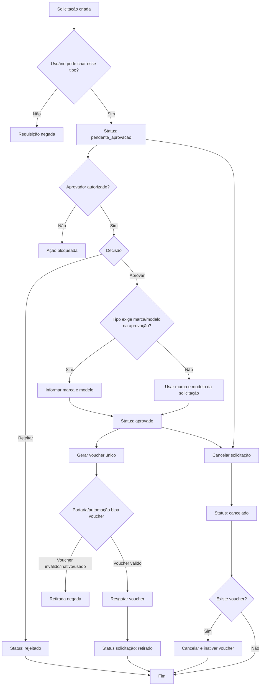

# Fluxo Operacional e Regras de Negócio

Este documento descreve o processo operacional implementado hoje na API de liberação de brindes, com foco no fluxo de solicitação, aprovação, voucher e retirada.

## Visão geral

O sistema controla a concessão de brindes para colaboradores por meio de uma solicitação formal, aprovada por usuários autorizados e finalizada pela retirada com bipagem de voucher.

## Atores do processo

- Solicitante autorizado
- Aprovador autorizado
- Portaria ou operador de liberação
- Automação/Admin para gestão de permissões e relatórios

## Fluxo operacional

### 1. Solicitação

O processo começa com um usuário autenticado criando uma solicitação.

Dados relevantes da solicitação:

- nome do colaborador
- matrícula
- RFID opcional
- código de barras opcional
- setor
- gerente
- tipo de requisição
- subgrupo de campanha quando aplicável
- marca e modelo, quando exigidos
- número do calçado

Validações de entrada:

- `matricula` e `num_calce` devem ser numéricos
- `num_calce` deve ficar entre `10` e `60`
- `tipo_requisicao` deve ser um dos tipos suportados
- para `campanha`, `subgrupo_campanha` é obrigatório
- para `teste_calce`, `brinde_interno` e `pense_aja`, `marca` e `modelo` são obrigatórios já na criação
- para `campanha` e `falta_zero`, `marca` e `modelo` podem ficar em aberto na criação

Regra de autorização:

- o usuário autenticado só pode criar a solicitação se estiver cadastrado em `user_criacao_solicitacao`
- além do cadastro, o tipo de requisição solicitado precisa estar dentro da lista de tipos permitidos para aquela matrícula

Resultado:

- a solicitação é criada com status `pendente_aprovacao`

### 2. Aprovação

Depois da criação, a solicitação segue para aprovação.

Regras:

- somente usuários autenticados e autorizados podem aprovar
- o middleware de acesso exige função contendo `gerente` ou setor `automacao`
- além disso, a matrícula do aprovador precisa existir em `user_aprovacao`
- o aprovador só pode aprovar tipos de requisição que estejam no seu escopo
- apenas solicitações com status `pendente_aprovacao` podem ser aprovadas

Regra especial por tipo:

- para `campanha` e `falta_zero`, `marca` e `modelo` se tornam obrigatórios no momento da aprovação
- para os demais tipos, a solicitação já precisa ter `marca` e `modelo` definidos

Resultado:

- a solicitação passa para `aprovado`
- são gravados `gerente_aprovacao`, `data_aprovado` e `updated_by`
- é criado um voucher único vinculado à solicitação

### 3. Rejeição

A solicitação também pode ser rejeitada em vez de aprovada.

Regras:

- as mesmas validações de autorização da aprovação se aplicam
- apenas solicitações `pendente_aprovacao` podem ser rejeitadas

Resultado:

- o status muda para `rejeitado`
- o processo se encerra sem gerar voucher

### 4. Liberação / retirada

Quando a solicitação está aprovada, a retirada é feita por bipagem do voucher.

Regras de autorização:

- somente usuários autenticados de `automacao`, `portaria` ou com função contendo `portaria` podem operar a retirada

Regras do voucher:

- o voucher precisa existir
- o voucher precisa estar vinculado a uma solicitação
- o voucher precisa estar ativo
- o voucher precisa estar com status `pendente`

Resultado:

- o voucher muda para `resgatado`
- o voucher é inativado
- é registrada a data de resgate
- a solicitação é marcada como:
  - `entregue = true`
  - `entregue_por = matrícula do operador`
  - `data_entregue = data/hora da operação`
  - `status = retirado`

### 5. Cancelamento

Uma solicitação ainda pode ser cancelada antes da retirada.

Regras:

- somente solicitações `pendente_aprovacao` ou `aprovado` podem ser canceladas
- se a solicitação já possui voucher, o voucher também deve ser cancelado

Resultado:

- a solicitação muda para `cancelado`
- se houver voucher:
  - `ativo = false`
  - `status = cancelado`

Observação:

- a rota exige `motivo`, mas o motivo ainda não é persistido no banco

## Estados do processo

### Solicitação

- `pendente_aprovacao`
- `aprovado`
- `rejeitado`
- `retirado`
- `cancelado`

### Voucher

- `pendente`
- `resgatado`
- `cancelado`

## Regras de negócio consolidadas

1. Toda solicitação nasce como `pendente_aprovacao`.
2. Somente usuários previamente autorizados podem criar solicitação por tipo de requisição.
3. Somente usuários aprovadores autorizados podem aprovar ou rejeitar.
4. Aprovação gera voucher único.
5. Voucher aprovado não pode ser reutilizado após resgate.
6. Cancelamento de solicitação aprovada deve inutilizar o voucher.
7. Solicitação rejeitada não gera voucher.
8. Solicitação retirada não pode voltar para estados anteriores pelo fluxo atual.
9. `campanha` exige `subgrupo_campanha`.
10. `campanha` e `falta_zero` permitem definição tardia de `marca` e `modelo`, feita na aprovação.

## Diagrama Mermaid

## Observações sobre o estado atual da implementação

- `GET /retiradas` ainda não possui implementação funcional
- existe infraestrutura de notificação no projeto, mas o fluxo principal ainda não dispara mensagens
- o projeto já possui dashboard administrativo para visão operacional e exportação de dados
