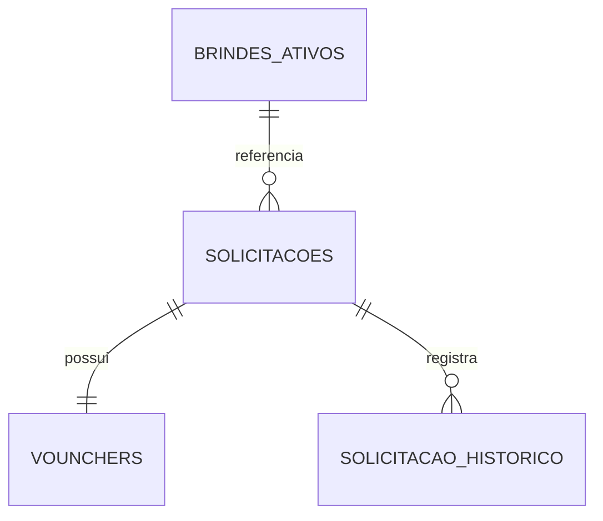

# Mapeamento de Tabelas do Banco de Dados

Este documento resume as principais tabelas usadas pela API, suas responsabilidades e relações funcionais.

## Esquemas utilizados

- `liberacao_brinde`
- `autenticacao`

## Tabelas principais em `liberacao_brinde`

### `solicitacoes`

Entidade principal do processo de liberação.

Campos relevantes:

- `id`
- `nome`
- `matricula`
- `rfid`
- `codbarras`
- `setor`
- `gerente`
- `tipo_requisicao`
- `subgrupo_campanha`
- `brinde_id`
- `marca`
- `modelo`
- `genero`
- `num_calce`
- `entregue`
- `entregue_por`
- `data_entregue`
- `gerente_aprovacao`
- `data_aprovado`
- `status`
- `usuario_criador`
- `updated_by`
- `created_at`
- `updated_at`

Relacionamentos:

- `1:1` com `vounchers`
- `1:N` com `solicitacao_historico`
- `N:1` com `brindes_ativos`

Observações:

- guarda snapshot operacional do brinde final
- `brinde_id` é opcional
- `marca` e `modelo` podem permanecer vazios até aprovação ou separação, dependendo do tipo

### `vounchers`

Tabela de vouchers associados a solicitações aprovadas.

Campos relevantes:

- `id`
- `codigo_voucher`
- `status`
- `ativo`
- `data_resgate`
- `solicitacao_id`
- `created_at`
- `updated_at`

Relacionamentos:

- `1:1` com `solicitacoes`

Observações:

- cada solicitação pode ter no máximo um voucher
- o voucher só é gerado após aprovação final

### `solicitacao_historico`

Auditoria das transições e alterações da solicitação.

Campos relevantes:

- `id`
- `solicitacao_id`
- `status_anterior`
- `status_novo`
- `acao`
- `usuario_matricula`
- `marca_anterior`
- `modelo_anterior`
- `marca_nova`
- `modelo_novo`
- `metadata`
- `created_at`

Relacionamentos:

- `N:1` com `solicitacoes`

Observações:

- persiste eventos de criação, aprovação, rejeição, separação, cancelamento e retirada
- também registra solicitação de troca e aprovação de troca
- `metadata` pode registrar `brinde_id`, motivo e outros dados auxiliares

### `brindes_ativos`

Catálogo administrativo de itens liberáveis.

Campos relevantes:

- `id`
- `nome`
- `tipo_requisicao`
- `subgrupo_campanha`
- `marca`
- `modelo`
- `genero`
- `num_calce`
- `ativo`
- `created_by`
- `updated_by`
- `created_at`
- `updated_at`

Relacionamentos:

- `1:N` com `solicitacoes`

Observações:

- representa catálogo operacional, não controle quantitativo de estoque
- pode conter itens genéricos ou específicos por combinação de atributos
- quando um item já foi usado em solicitação, a exclusão deve preferir inativação lógica

### `user_aprovacao`

Permissões administrativas para aprovação.

Campos relevantes:

- `id`
- `nome`
- `matricula`
- `rfid`
- `codbarras`
- `tipo_requisicao[]`
- `pode_aprovar_troca`
- `updated_by`
- `created_at`
- `updated_at`

Observações:

- controla o escopo de aprovação por tipo de requisição
- `tipo_requisicao` pode ficar nulo para aprovadores globais de troca
- `pode_aprovar_troca` habilita a fila e a aprovação de solicitações em `aguardando_troca`

### `user_admin`

Permissões administrativas com escopo por tipo de requisição.

Campos relevantes:

- `id`
- `matricula`
- `nome`
- `tipo_requisicao[]`
- `created_by_matricula`
- `created_at`

Observações:

- define o escopo de visibilidade e gestão do `Admin` comum
- `Admin Master` não depende desta tabela, pois é identificado pelo `setor` do JWT
- apenas `Admin Master` pode criar ou remover registros desta tabela

### `user_criacao_solicitacao`

Permissões para abertura de solicitações.

Campos relevantes:

- `id`
- `nome`
- `matricula`
- `rfid`
- `codbarras`
- `tipo_requisicao[]`
- `created_by`
- `updated_by`
- `created_at`
- `updated_at`

Observações:

- controla quais matrículas podem criar cada tipo de solicitação

### `user_separacao`

Permissões operacionais para a etapa de separação.

Campos relevantes:

- `id`
- `nome`
- `matricula`
- `rfid`
- `codbarras`
- `tipo_requisicao[]`
- `created_by`
- `updated_by`
- `created_at`
- `updated_at`

Observações:

- não deve receber `teste_calce` como permissão
- suporta `sandalia` e demais tipos que passam pela separação

### `user_bipagem`

Permissões operacionais para retirada e abertura de troca.

Campos relevantes:

- `id`
- `nome`
- `matricula`
- `rfid`
- `codbarras`
- `tipo_requisicao[]`
- `created_by`
- `updated_by`
- `created_at`
- `updated_at`

Observações:

- controla quem pode bipar vouchers e solicitar troca
- quando `tipo_requisicao` não é informado no cadastro, o usuário recebe permissão para todos os tipos

### `notification_email`

Tabela auxiliar ligada à infraestrutura de notificação.

Observações:

- não participa do fluxo principal de solicitação, aprovação, separação e retirada

## Tabela principal em `autenticacao`

### `usuarios`

Fonte de autenticação e cadastro institucional.

Campos relevantes usados pela API:

- `matricula`
- `nome`
- `usuario`
- `funcao`
- `setor`
- `unidade`
- `nivel`
- `codigo_barras`
- `rfid`
- `email`

Observações:

- usada como base de autenticação e enriquecimento de dados no dashboard e permissões

## Relações resumidas

## Observações sobre modelagem

- `solicitacoes` continua sendo a fonte de verdade do snapshot final do brinde
- `brindes_ativos` funciona como catálogo configurável
- a auditoria de processo fica concentrada em `solicitacao_historico`
- permissões operacionais e administrativas são separadas por tabela e por tipo de requisição
- `user_admin` concentra o escopo administrativo por tipo para usuários não master
