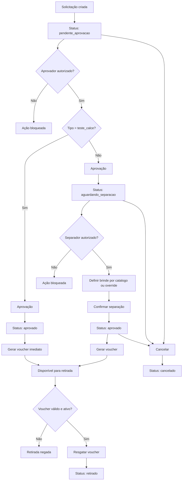

# Regras de Negócio e Fluxo Operacional

Este documento consolida o comportamento atual da API de liberação de brindes após a introdução da etapa de separação, do catálogo modular de brindes ativos e dos novos campos de logística.

## Visão geral

O sistema controla a concessão de brindes e calçados por meio de:

- solicitação autenticada
- aprovação por usuários autorizados
- separação operacional quando aplicável
- geração de voucher
- retirada por bipagem
- trilha de histórico persistida

## Atores

- solicitante autorizado
- aprovador autorizado
- operador de separação
- portaria ou operador de retirada
- administrador de permissões e catálogo

## Tipos de requisição

- `teste_calce`
- `brinde_interno`
- `pense_aja`
- `campanha`
- `falta_zero`
- `sandalia`

## Subgrupos de campanha

- `brigada_incendio`
- `eficiencia`
- `hora_extra`
- `brinde_5s`

`brinde_5s` não é um `tipo_requisicao` próprio. Ele é tratado como `subgrupo_campanha` dentro de `campanha`.

## Campos de negócio relevantes

- `tipo_requisicao`
- `subgrupo_campanha`
- `genero`
- `num_calce`
- `marca`
- `modelo`
- `brinde_id`

## Regras de criação da solicitação

### Autorização

- o usuário autenticado precisa existir em `user_criacao_solicitacao`
- o `tipo_requisicao` informado precisa estar dentro dos tipos permitidos daquela matrícula

### Validações gerais

- `matricula` e `num_calce` devem ser numéricos
- `num_calce` deve estar entre `10` e `60`
- `genero` é obrigatório em novas solicitações
- `brinde_id` é opcional

### Regras por tipo

- `teste_calce`
  - `marca` e `modelo` obrigatórios na criação
- `brinde_interno`
  - `marca` e `modelo` opcionais na criação
- `pense_aja`
  - `marca` e `modelo` opcionais na criação
- `campanha`
  - `subgrupo_campanha` obrigatório
  - `marca` e `modelo` opcionais na criação
- `falta_zero`
  - `marca` e `modelo` opcionais na criação
- `sandalia`
  - `genero` obrigatório
  - `num_calce` obrigatório
  - `marca` e `modelo` opcionais na criação

### Catálogo de brindes

- quando `brinde_id` é informado, ele deve referenciar um item ativo do catálogo
- o item selecionado precisa ser compatível com:
  - `tipo_requisicao`
  - `subgrupo_campanha`, quando o tipo for `campanha`
  - `genero`, quando o item for restrito por gênero
  - `num_calce`, quando o item for restrito por tamanho
- a solicitação mantém snapshot de `marca` e `modelo` para preservar histórico, mesmo que o cadastro do brinde seja alterado depois

## Regras de aprovação

### Autorização

- exige autenticação
- exige middleware `isManager`
- a matrícula precisa existir em `user_aprovacao`
- o aprovador só pode aprovar tipos dentro do próprio escopo

### Estados válidos

- apenas solicitações `pendente_aprovacao` podem ser aprovadas

### Resultado por tipo

- `teste_calce`
  - sai de `pendente_aprovacao` para `aprovado`
  - gera voucher imediatamente
- demais tipos
  - saem de `pendente_aprovacao` para `aguardando_separacao`
  - ainda não geram voucher

### Definição de brinde na aprovação

- a aprovação pode:
  - usar o snapshot já existente
  - aceitar `brinde_id`
  - aceitar override de `marca/modelo`
- para `campanha` e `falta_zero`, o brinde pode ser consolidado nessa etapa
- para `teste_calce`, o brinde já precisa estar resolvido na solicitação

## Regras de separação

### Autorização

- exige autenticação
- a matrícula precisa existir em `user_separacao`
- o operador só pode atuar nos tipos dentro do próprio escopo

### Estados válidos

- apenas solicitações `aguardando_separacao` podem ser separadas

### Regras operacionais

- o operador pode confirmar por:
  - `brinde_id`
  - override manual de `marca/modelo`
  - combinação dos dados já presentes na solicitação
- ao final da separação, `marca` e `modelo` precisam estar preenchidos
- a solicitação passa para `aprovado`
- o voucher é gerado nessa transação

## Regras de rejeição

- exige as mesmas permissões da aprovação
- apenas solicitações `pendente_aprovacao` podem ser rejeitadas
- o status final é `rejeitado`
- não há geração de voucher

## Regras de retirada

### Autorização

- exige autenticação
- permitido para usuários de `automacao`, `portaria` ou com função contendo `portaria`

### Regras do voucher

- o voucher precisa existir
- o voucher precisa estar vinculado à solicitação
- o voucher precisa estar ativo
- o voucher precisa estar com status `pendente`

### Resultado

- o voucher passa para `resgatado`
- o voucher é inativado
- a solicitação passa para `retirado`

## Regras de cancelamento

- permitido para:
  - `pendente_aprovacao`
  - `aguardando_separacao`
  - `aprovado`
- se já houver voucher, ele também deve ser cancelado e inativado
- o motivo é exigido na rota e fica registrado no histórico

## Catálogo de brindes ativos

O catálogo administrativo é usado para modularizar a gestão dos itens liberáveis.

### Objetivo

- centralizar itens liberáveis
- permitir manutenção por administrador
- desacoplar o cadastro do item do fluxo transacional da solicitação

### O que o catálogo representa

- um conjunto de brindes ativos disponíveis para seleção operacional
- não representa saldo de estoque
- não controla quantidade física

### Regras do catálogo

- um item pode ser genérico ou específico por marca/modelo/gênero/calce
- apenas itens com `ativo = true` podem ser selecionados por `brinde_id`
- remoção administrativa de item já usado em solicitações deve resultar em inativação, preservando integridade histórica

## Status do processo

### Solicitação

- `pendente_aprovacao`
- `aguardando_separacao`
- `aprovado`
- `rejeitado`
- `retirado`
- `cancelado`

### Voucher

- `pendente`
- `resgatado`
- `cancelado`

## Histórico de solicitação

Cada solicitação mantém eventos persistidos em tabela própria, cobrindo:

- criação
- aprovação
- rejeição
- encaminhamento para separação
- confirmação da separação
- cancelamento
- retirada

Esse histórico também registra alterações de `marca/modelo` e metadados como `brinde_id` e motivo de cancelamento.

## Diagrama resumido

## Observações

- `GET /api/retiradas` ainda é somente um preview
- o sistema já suporta infraestrutura de notificação, mas o fluxo principal ainda não depende dela para operar
